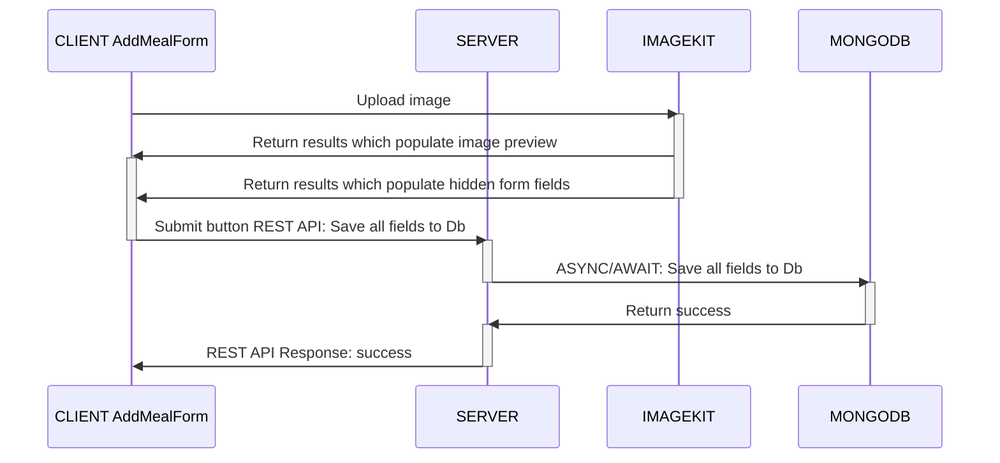
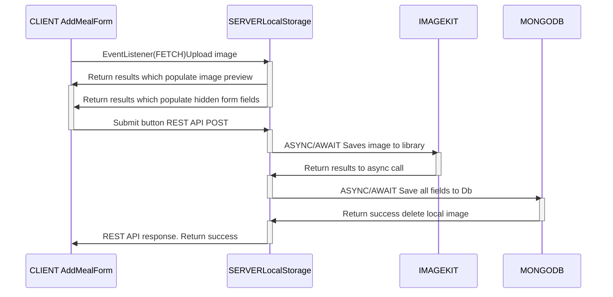

# Client Side Image upload for new meal

In the context of saving a new meal, this document describes the image upload process, it's requirements and reasons for solution implemented.

For details on Server side image upload, see 3.2 Previous implementation.

# 1. Process

## 1.1 Description
Each Meal is stored as document in MongoDB. Meal image is not stored in MongoDB. Only reference of image (ImageKit-ImageID, locationURL, etc) saved to corresponding meal document in  MongoDB.

This means the image must be saved and an ImageKit-ImageID returned to client so that when client saves the meal data (a form) to MongoDB, the respective image data is available.

## 1.2 Sequence diagram

## 1.3 Database fields

non-exhaustive, just for understanding purposes

| MongoDB document field | Source | Comment |
|---|:---|---|
|Meal Id |mongoDB|auto generated by mongoDB|
|Meal Name|User input in new meal form|Required field|
|Meal Category|User input in new meal form|Required field|
|Meal Description|User input in new meal form|Optional field|
|Image Name|ImageKit API results of upload|Required field|
|imagekit Image Id|ImageKit API results of upload|Required field|
|Image Location URL|ImageKit API results of upload|Required field|
|Image Thumbnail URL|ImageKit API results of upload|Optional field|

# 2. Requirements

- Saving a new meal, user enters meal name, description, category and image. Meal data is stored in MongoDB.
- The meals' image is saved to imageKit.io ligrary. The MongoDB meal document contains reference to the image location. Image is not stored in MongoDB.
- Client side image upload in order to reduce load, traffic and complexity on the server.
- User can select existing image on device or capture a new image using device camera.
- A preview of the selected / captured image is optionaldesired but optional at this stage.

# 3. Solutions Available
1. Use ImageKit client side upload API, Javascript.
2. Use a upload widget
   1. Uppy - A sleek, modular JavaScript file uploader that integrates seamlessly with any application. It allows users to pick files from local devices, webcam or Drive, Facebook, Instagram, and Dropbox.Uppy - A sleek, modular JavaScript file uploader that integrates seamlessly with any application. It allows users to pick files from local devices, webcam or Drive, Facebook, Instagram, and Dropbox.
   2. Dropzone.js - An open-source JS library that provides drag and drop file uploads with image previews. It’s lightweight, doesn’t depend on any other library (like jQuery), and is highly customizable.

## 3.2 Previous implementation
Server side image upload (Multer, server local storage) was used and worked pretty well. Reasons for changing to client side upload are:
- Reduce load & bandwidth to server
- Reduce complexity of the process
- Reduce deployment complexity. Local storage image folder was sometimes missing upon deployment if empty (DigitalOcean). Had to CLI into server and manually create the folder.

The server side solution worked as follows

## Comparison

|Feature|1 ImageKit API| 2.1 Uppy JS Framework| 2.2 Dropzone JS Framework|
|-------|:----------:|:-----------------:|:------------------:|
|Preview added image|no, custom css/js needed|yes|yes|
|Source: Camera|device browser whim. Had issues iPhone vs android|yes|yes|
|Source: Local device|yes|yes|yes|
|Source: gdrive, dropbox, facebook, Instagram|no|yes|?|
|Beginner friendliness|Very good. Official documentation|Very good. Official ImageKit-Uppy API and documentation|Not good. Focused on drag-n-drop|

# 4 Solution
Work in progress...
Implementing image upload with Uppy JS using the official ImageKit-Uppy API